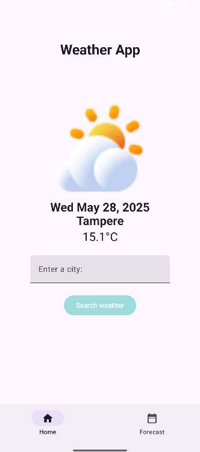
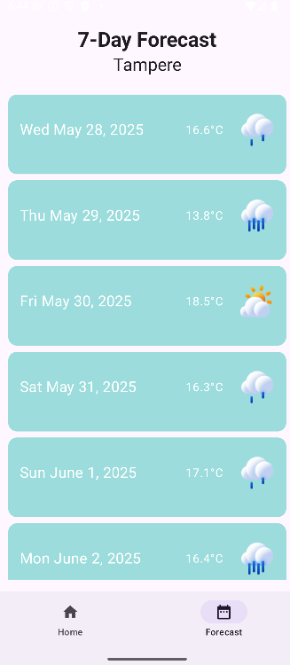

# 📦 Project Work - Weather Forecasting App with Open-Meteo

> Weather App for Android

---

## 🧠 Table of Contents

- [About](#about)
- [Features](#features)
- [Screenshots](#screenshots)
- [Screencast](#screencast)
- [Getting Started](#getting-started)
- [Usage](#usage)
- [Tech Stack](#tech-stack)
- [Contact](#contact)

---

## 📖 About

Weather App for Android. Developed as a final project in Native Mobile Development course.

---

## ✨ Features

- ✅ Shows current weather based on city (Tampere by default)
- ✅ Allows user to fetch other city's weather information through text input
- ✅ Bottom nav bar built with navController to navigate between home and forecast screens
- ✅ 7-day forecast of current city + more detailed info when day selected
- ✅ Intuitive and minimalistic design solutions through shared viewModel

---

## 📸 Screenshots




---

## 🎦 Screencast

https://youtu.be/O1nyN-0EZlE

---

## 🚀 Getting Started

### Prerequisites

- Android Studio
- Android SDK version 35 or above
- JDK 11->

### ⚙️ Installation and Usage

```bash
# Clone the repository
git clone [https://github.com/your-username/weather-app-for-android
```

Opening the app in Android Studio:
- Select the cloned directory
- Android Studio will download needed dependencies automatically
- Check if you have a virtual or physical device connected
- Click the "Run" button on the top bar or Shift+F10

For mobile:
- Download the apk file attached to this project
- Install it onto your device
- Open the app

---

## 🧰 Tech Stack

- Language: Kotlin, Java
- Framework: Jetpack Compose/Android Studio
- Tools: Open-Meteo API, Geocoding API

---

## 📫 Contact

Project maintained by Laura Shemeikka, 2025
